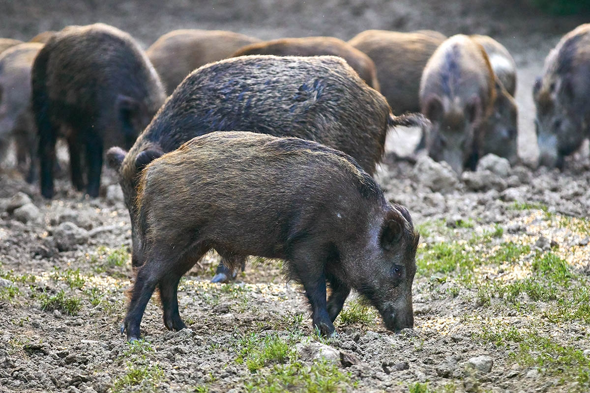

# Feral pigs on Jack and Laura Dangermond Preserve

Feral pig (*Sus scrofa*) is an invasive species in North America. With high intelligence, strong adaptability, and no natural predators in the wild, feral pig population grows and expands very fast and has successfully occupied most counties in California. The species feeds on various local vegetations as well as small animals. Its rooting behavior can damage protected land surface, disturbing conservation work on the Jack and Laura Dangermond Preserve (JLDP). TNC at the JLDP has placed camera trap stations and recorded feral pig activities at several locations as shown on the map as **feral pig group size**. Click on the vegetation type layers (**Tree**, **Shrub**, or **Herb**) will allow you to explore more detailed information on the vegetation type. Uncheck those layers will reveal trails on the preserve where most cameras were placed on. Besides trails, feral pigs also travel along streams to migrate between water ponds or coastal areas, which worth paying attention to. Lastly, pig activities along the beachside may have impact on the nesting of **Western Snowy Plover** whose individual sampling results are also mapped below.

<iframe src="asst2/feralpigs_JLDP/index.html" height=600 width=1000></iframe>
